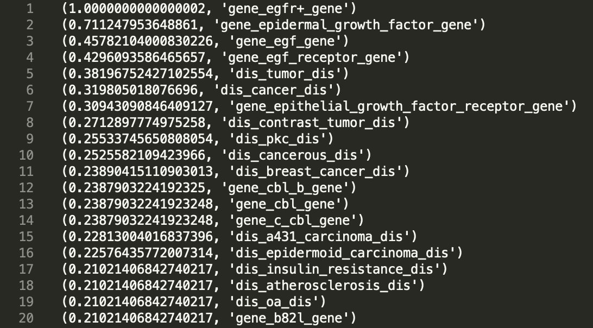

# Cosine Similarity
CSCI 49376: Big Data Technology

Authors: Liulan Zheng, Yiheng Cen Feng

# Overview
This program computes [Cosine Similarity](https://en.wikipedia.org/wiki/Cosine_similarity) of a given term and the other terms using MapReduce algorithm and Spark implementation. Output will be sorted by cosine similarity in descending order.

We implemented it using two methods. ``similarity_slow.py`` produces a matrix using ``cartesian()``, which is a slow approach and can leads to memory error. ``similarity_fast.py`` calculates cosine similarity without making a matrix by just comparing the document ids. This approach is faster and more efficient.

# Requirements
- Python
- Apache Spark
- PySpark
	```
	pip install pyspark
	```


# Run 
```
spark-submit similarity_fast.py <filename> <query_term>
```
Output will be partitioned and saved in ``output/``. Make sure you delete ``output/`` before running the program again. 

### P.S.
To simplify the process, ``output/`` will only contains terms in the form of ``dis_..._dis`` and ``gene_..._gene``

# Example Query
```
spark-submit similarity_fast.py project2_test.txt "gene_egfr+_gene"
```
### Output

